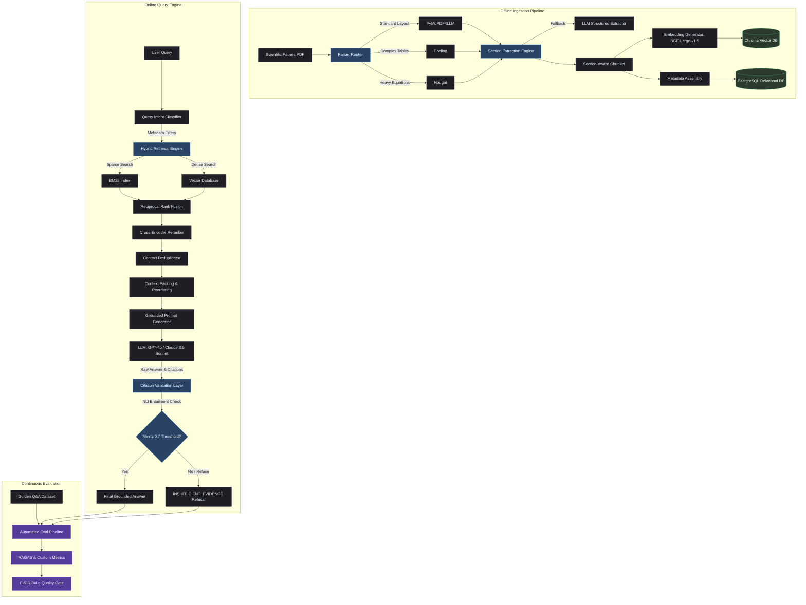
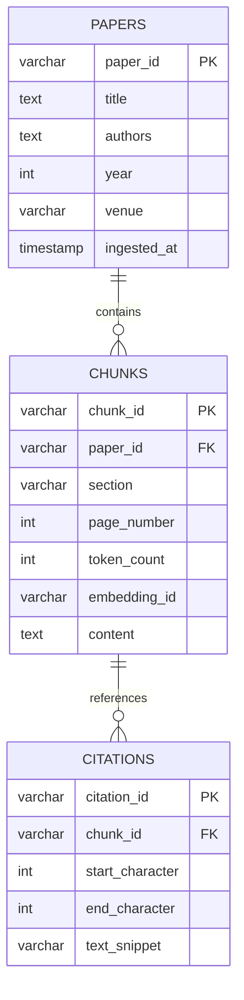

# Research Intelligence System
## Citation-Grounded Research Assistant with Hybrid Retrieval, Reranking, and Automated Evaluation

---

# 1. Executive Summary

The **Research Intelligence System** is a production-grade, enterprise-ready Retrieval-Augmented Generation (RAG) platform designed to solve the critical challenges of accuracy, auditability, and validation when extracting knowledge from dense, multi-format scientific literature. 

Unlike naive "PDF Chatbot" implementations that suffer from extrinsic hallucinations, spatial layout losses, and unverified outputs, this system is engineered with a **zero-trust citation validation framework**. It leverages page-level multi-modal ingestion routing, section-aware semantic chunking, reciprocal rank fusion (RRF) for hybrid retrieval, cross-encoder reranking, and an NLI-based claim verification engine. 

Furthermore, to guarantee reliability across prompt iterations and retrieval modifications, the platform incorporates a continuous evaluation pipeline integrated into the CI/CD lifecycle, ensuring semantic regression prevention through automated quality gates.

```
+---------------------------------------------------------------------------------+
|                               SYSTEM OBJECTIVES                                 |
+--------------------------+--------------------------+---------------------------+
|      GROUNDEDNESS        |     HYBRID RETRIEVAL     |      AUTO EVALUATION      |
|   Strict NLI validation  |   Dense BGE-Large-v1.5   |   Continuous RAGAS-based  |
|  and claim verification  |    + Sparse BM25 + RRF   |     regression metrics    |
+--------------------------+--------------------------+---------------------------+
```

---

# 2. Problem Statement

Extracting accurate scientific insights from unstructured research papers remains a high-risk operational challenge. Naive RAG pipelines fail in production environments due to five primary architectural limitations:

### 2.1 Information Overload & Multi-Modal Layout Complexity
Scientific papers are non-linear documents. They present dense academic text interspersed with multi-column layouts, embedded tables, complex LaTeX mathematical equations, and cross-references. Traditional text extraction strips away these relationships, merging table columns into illegible streams of characters and flattening mathematical notation into gibberish.

### 2.2 Vector Search Semantic Drift (Poor Search Quality)
Dense vector search captures general semantic similarity but struggles with domain-specific keyword matches, acronyms, and direct numerical attributes.
* **Query:** `"Long Context Retrieval in LLMs"`
* **Relevant Context:** `"Efficient Context Compression and Needle-in-a-Haystack Retrieval"`
While semantically aligned, their embeddings may have low similarity in a standard vector space, whereas hybrid search (combining BM25 and dense retrieval) bridges this gap.

### 2.3 Hallucinations & The Illusion of Accuracy
Large Language Models (LLMs) are optimized for conversational coherence rather than strict truthfulness. When queried on complex scientific methodologies or hyperparameter configurations, the model will often fabricate plausible-sounding details (extrinsic hallucinations) when the retrieval corpus lacks the answer.

### 2.4 Lack of Auditable Trust (The Citation Gap)
In the scientific domain, an unreferenced assertion is useless. Researchers require a clear, traceable path from a generated claim to the underlying evidence:

$$\text{Claim} \xrightarrow{\text{Validated By}} \text{Supporting Context Chunk} \xrightarrow{\text{Anchored To}} \text{Source Paper, Section \& Page}$$

If the linkage is missing or imprecise, the system's utility drops to zero for high-consequence decision support.

### 2.5 Evaluation Blindspots
Most RAG applications are developed iteratively using ad-hoc, manual verification ("vibes-based engineering"). A change to the system prompt, chunk size, or embedding model might fix one edge case while silent regressions break ten others. Without automated evaluation, regression detection is impossible.

---

# 3. System Objectives

To address these challenges, the Research Intelligence System executes on the following production criteria:

* **Objective 1: Multi-Format Semantic & Structural Search:** Ingest scientific literature, maintaining tables and mathematical representations. Retrieve nodes with high structural and semantic relevancy ($\text{NDCG@5} > 0.82$).
* **Objective 2: Source-Grounded Generation:** Generate comprehensive answers where *every* factual assertion is mapped directly to a specific document section and page citation.
* **Objective 3: Calibrated Refusal Engine:** Implement a zero-trust threshold. If retrieved context contains insufficient evidence to support the hypothesis, the system must issue a standard refusal (`"INSUFFICIENT_EVIDENCE"`) rather than attempting to synthesize a response.
* **Objective 4: Quantitative Evaluation Harness:** Track retrieval metrics (Recall@K, MRR) and generation metrics (Faithfulness, Context Precision) using a golden test dataset.
* **Objective 5: CI/CD Integration (Quality Gate):** Treat semantic performance as a software build artifact. Automatically run evaluations on changes to prompts, configurations, or retrieval pipelines and fail builds if faithfulness drops below a strict SLA ($0.85$).

---

# 4. High-Level Architecture

The system operates across two distinct lifecycle phases: the **Offline Ingestion Pipeline** and the **Online Query Engine**.



---

# 5. Document Ingestion Layer

The ingestion pipeline handles structural classification and page-level content routing. Traditional PDF parsers process all documents uniformly, which corrupts layout-sensitive content. 

```
               [ Input Research PDF ]
                         │
                         ▼
             [ Page-Level Feature Analyzer ]
             /           │             \
  pipe_ratio > 0.15      │      equation_hits > 3
        /                ▼                \
       ▼                 ▼                 ▼
+──────────────+  +──────────────+  +──────────────+
|   Docling    |  | PyMuPDF4LLM  |  |    Nougat    |
| (Table Page) |  | (Text Page)  |  | (Math Page)  |
+──────────────+  +──────────────+  +──────────────+
       \                 │                 /
        ▼                ▼                ▼
         [ Normalized Unified Markdown ]
```

### 5.1 Parser Options
* **PyMuPDF4LLM:** High-performance, lightweight engine that extracts structured text, preserves headers, list formatting, and outputs cleanly formatted markdown representations of standard academic pages.
* **Docling:** An advanced document-understanding SDK utilizing deep learning layouts to detect and reconstruct multi-column hierarchies and complex, nested tabular structures into structured JSON or Markdown grids.
* **Nougat (Neural Optical Understanding for Academic Documents):** An end-to-end OCR model based on a Transformer architecture that reads page images and outputs LaTeX source code directly for mathematical expressions and equations.

### 5.2 Dynamic Parser Router Logic
Each PDF is split into individual pages, which are analyzed by a routing engine. Pages are classified based on visual and lexical markers, then routed to the optimal parser:

```python
import fitz # PyMuPDF
import re

def analyze_page_features(page: fitz.Page) -> dict:
    """
    Extracts structural layout metrics from a PDF page to determine routing.
    """
    text = page.get_text("text")
    drawings = page.get_drawings()
    
    # 1. Pipe Ratio: Check for dense table markdown structures or vertical boundaries
    # Draw operations that draw vertical line paths indicate grid columns
    vertical_lines = sum(1 for d in drawings if any(p[0] == "l" and abs(p[1].x - p[2].x) < 1.0 for p in d["items"]))
    char_count = len(text)
    pipe_ratio = (text.count("|") / max(char_count, 1)) + (vertical_lines / max(char_count, 1))

    # 2. Equation Hits: LaTeX patterns, bracket structures, and mathematical symbol density
    math_patterns = [
        r"\$\$.*?\$\$",          # Block math
        r"\$.*?\$",              # Inline math
        r"\\begin\{equation\}",  # LaTeX env
        r"\\int|\\sum|\\alpha|\\beta|\\gamma|\\theta|\\infty|\\partial" # Math characters
    ]
    equation_hits = sum(len(re.findall(pat, text)) for pat in math_patterns)
    
    return {
        "pipe_ratio": pipe_ratio,
        "equation_hits": equation_hits,
        "char_count": char_count
    }

def route_page(pdf_path: str, page_number: int) -> str:
    doc = fitz.open(pdf_path)
    page = doc.load_page(page_number)
    features = analyze_page_features(page)
    
    if features["pipe_ratio"] > 0.15:
        return "docling"      # Optimized for complex tabular extraction
    elif features["equation_hits"] > 3:
        return "nougat"       # Optimized for optical mathematical character recognition
    else:
        return "pymupdf4llm"  # Standard high-speed markdown extraction
```

---

# 6. Section Extraction Layer

Scientific papers share a standard logical progression. Understanding which section a chunk belongs to is critical for query routing, target retrieval filtering, and contextual relevance.

### 6.1 Section Taxonomy
We map heterogeneous document headings to a canonical list of nine core sections:
1. `abstract`
2. `introduction`
3. `methodology`
4. `experiments`
5. `results`
6. `discussion`
7. `limitations`
8. `conclusion`
9. `references`

### 6.2 Regex Header Matching & LLM Fallback Routing
```
   [ Input Parsed Markdown ]
               │
               ▼
   [ Regex Heading Parser ] ─────────► (Found >= 4 canonical sections?)
               │                                   │
               │ No                                │ Yes
               ▼                                   ▼
[ LLM Section Identification ]            [ Map to Database Schema ]
               │
               ▼
     [ Fallback Check ] ─────────────► (Parsed Successfully?)
               │                                   │
               │ No                                │ Yes
               ▼                                   ▼
[ Fixed Window Chunking fallback ]        [ Map to Database Schema ]
```

The system uses a hierarchical regex parser to map document headings to these canonical sections:

```python
CANONICAL_SECTIONS = {
    "abstract": [r"\babstract\b", r"\bsummary\b"],
    "introduction": [r"\bintroduction\b", r"\bbackground\b", r"\bmotivation\b"],
    "methodology": [r"\bmethodology\b", r"\bproposed method\b", r"\bapproach\b", r"\bsystem model\b", r"\bmathematical formulation\b"],
    "experiments": [r"\bexperiments\b", r"\bevaluation setup\b", r"\bexperimental setup\b", r"\bmethodology implementation\b"],
    "results": [r"\bresults\b", r"\bempirical evaluation\b", r"\bfindings\b"],
    "discussion": [r"\bdiscussion\b", r"\banalysis\b", r"\brelated work\b"],
    "limitations": [r"\blimitations\b", r"\bthreats to validity\b", r"\bfuture work\b"],
    "conclusion": [r"\bconclusion\b", r"\bconcluding remarks\b"],
    "references": [r"\breferences\b", r"\bbibliography\b"]
}

def map_heading_to_section(heading_text: str) -> str:
    clean_heading = heading_text.lower().strip()
    for section_name, patterns in CANONICAL_SECTIONS.items():
        for pattern in patterns:
            if re.search(pattern, clean_heading):
                return section_name
    return "other"
```

### 6.3 Recovery & Fallback Strategies
* **LLM-Assisted Extraction:** If the regex pass identifies fewer than 4 canonical sections (common in papers with creative section titles like *"A Case for Deep Learning"*), the page structure and the raw document structure are passed to a light structural LLM parse query (using `gpt-4o-mini` with structured JSON output) to map the document's custom headers to our canonical taxonomy.
* **Fixed Window Chunking Fallback:** If the LLM extraction fails or timeouts, the system falls back to a structural chunking strategy using a recursive character text splitter, marking the section field as `"unknown"`.

---

# 7. Chunking Layer

Naive chunking strategies split documents at arbitrary token counts. This splits sentences across paragraphs, cuts mathematical formulas in half, and results in context fragmentation.

### 7.1 Section-Aware Chunking Strategy
The Research Intelligence System implements a **Section-Aware Chunking Strategy**. Chunk boundaries are strictly bounded by canonical section divisions. Information from one section never leaks into the adjacent section inside a single chunk.

```
Naive Chunking (Fixed Size):
[... Intro Text ... \n\n Methodology Heading ... Model Details ...]  <-- Chunk Bleed
                     ▲
            Arbitrary Split Point

Section-Aware Chunking:
+------------------------------------------+  +-----------------------------------------+
| CHUNK 1 (Section: introduction)          |  | CHUNK 2 (Section: methodology)          |
| ... Introduction Text ...                |  | Methodology Heading... Model Details... |
+------------------------------------------+  +-----------------------------------------+
```

### 7.2 Chunking Parameters
Within each canonical section, chunks are generated using recursive character splitting based on the following configurations:
* **Target Chunk Size:** $700\text{ tokens}$ (~500 words). This provides sufficient context while preventing dilution of dense information.
* **Overlap:** $100\text{ tokens}$ (~70 words). This ensures continuity of context across chunk borders.
* **Length Function:** Character-based estimate mapping closely to tokenizer expectations ($1\text{ token} \approx 4\text{ characters}$).

### 7.3 Chunk Metadata Payload
Each generated chunk is stored with a detailed metadata payload:

```json
{
  "chunk_id": "chk_8a9b2c3d_4e5f",
  "paper_id": "arxiv_2304_08485",
  "section": "methodology",
  "page_number": 6,
  "start_char_idx": 4501,
  "end_char_idx": 7320,
  "token_count": 685,
  "embedding_id": "emb_8a9b2c3d"
}
```

---

# 8. Embedding Layer

To capture semantic relationships within scientific literature, the embedding layer uses a state-of-the-art dual-purpose representation model.

### 8.1 Model Details
* **Model:** `BAAI/bge-large-en-v1.5`
* **Embedding Dimension:** $1024$
* **Context Window Limit:** $512\text{ tokens}$ (Input chunks exceeding this limit are split or truncated, ensuring alignment with our $700$ character/token target chunking size which maps to physical sub-segments of text).
* **Asymmetric Search Prefix:** The BGE model requires query-side prefixing to maximize recall performance during retrieval.
  * **Query Prefix:** `"Represent this sentence for searching relevant passages: "`
  * **Document Chunk Prefix:** `""` (None)

### 8.2 Vector Quantization Strategy
In production vector databases, storage memory grows linearly with volume. A 1024-dimensional float32 vector requires $4\text{ KB}$ of memory. To maintain high query throughput under constrained hardware:
1. **Index Precision:** FP16 representation inside the ChromaDB vector database index.
2. **Distance Metric:** Cosine similarity.

$$\text{Cosine Similarity}(u, v) = \frac{u \cdot v}{\|u\| \|v\|}$$

---

# 9. Storage Layer

The system uses a **Dual-Database Architecture** to separate high-dimensional vector search indices from relational metadata, audit trails, and evaluation records.

```
                      [ Raw Parse Payload ]
                               │
                ┌──────────────┴──────────────┐
                ▼                             ▼
      [ Embeddings & Text ]         [ Metadata & Relational ]
                │                             │
                ▼                             ▼
        +───────────────+             +───────────────+
        |   ChromaDB    |             |  PostgreSQL   |
        |  (Vector DB)  |             | (Metadata DB) |
        +───────────────+             +───────────────+
```

### 9.1 ChromaDB (Vector Search Engine)
Stores vector embeddings and raw text chunks. It handles high-speed HNSW (Hierarchical Navigable Small World) index navigation to resolve the nearest-neighbor vectors during semantic dense search.

### 9.2 PostgreSQL (Metadata & Relational Ledger)
Stores paper catalog details, chunk relationships, citation mappings, and system metrics. It supports structured SQL queries, relational integrity checks, and logs evaluation histories.

---

# 10. Metadata Schema

The relational database is constructed around a normalized schema configured with indices optimized for RAG retrieval filtering.



### 10.1 Papers Table Schema
```sql
CREATE TABLE papers (
    paper_id VARCHAR(50) PRIMARY KEY,
    title TEXT NOT NULL,
    authors TEXT,
    year INTEGER,
    venue VARCHAR(100),
    ingested_at TIMESTAMP WITH TIME ZONE DEFAULT CURRENT_TIMESTAMP
);

CREATE INDEX idx_papers_year_venue ON papers(year, venue);
```

### 10.2 Chunks Table Schema
```sql
CREATE TABLE chunks (
    chunk_id VARCHAR(50) PRIMARY KEY,
    paper_id VARCHAR(50) REFERENCES papers(paper_id) ON DELETE CASCADE,
    section VARCHAR(50) NOT NULL,
    page_number INTEGER NOT NULL,
    token_count INTEGER NOT NULL,
    embedding_id VARCHAR(100) UNIQUE NOT NULL,
    content TEXT NOT NULL
);

CREATE INDEX idx_chunks_paper_section ON chunks(paper_id, section);
CREATE INDEX idx_chunks_embedding ON chunks(embedding_id);
```

---

# 11. Retrieval Layer

RAG pipelines that rely solely on dense embeddings often fail to resolve specific terminology, math equations, or exact acronyms. The Research Intelligence System uses a **Hybrid Retrieval Model** that runs BM25 lexical search and dense vector search in parallel.

```
                          [ User Query ]
                                 │
                ┌────────────────┴────────────────┐
                ▼                                 ▼
      [ Sparse Retriever ]              [ Dense Retriever ]
        BM25 on Text                       Cosine on Vector
                │                                 │
                ▼                                 ▼
     Candidate List (Rank A)           Candidate List (Rank B)
                │                                 │
                └────────────────┬────────────────┘
                                 ▼
                    [ Reciprocal Rank Fusion ]
                                 │
                                 ▼
                       Unified Candidate List
```

* **Sparse Search (BM25):** Employs term frequency-inverse document frequency concepts to score matches based on exact lexical tokens.
* **Dense Search (Vector Embedding):** Navigates the vector space to identify contextual matches, capturing concepts even when matching vocabulary is absent.

---

# 12. Reciprocal Rank Fusion (RRF)

To unify the candidate lists from BM25 and Dense vector searches, the system implements **Reciprocal Rank Fusion**. This technique sorts candidates based on a constant-smoothed reciprocal rank across both pipelines, avoiding the need to calibrate arbitrary normalization weights between cosine similarity and BM25 scores.

### 12.1 The RRF Algorithm
The score for a document $d \in D$ is calculated as:

$$RRF(d) = \sum_{m \in M} \frac{1}{k + r_m(d)}$$

Where:
* $M$ is the set of retrievers (in our case, $2$: Sparse and Dense).
* $r_m(d)$ is the rank of document $d$ in retriever $m$ (1-indexed).
* $k$ is a constant scaling parameter (standard industry default: $60$).

### 12.2 Python Implementation of RRF
```python
def compute_rrf(sparse_results: list[dict], dense_results: list[dict], k: int = 60) -> list[dict]:
    """
    sparse_results: Ordered list of dicts with key 'chunk_id'
    dense_results: Ordered list of dicts with key 'chunk_id'
    """
    rrf_scores = {}
    
    # helper to process rankings
    def process_rankings(results):
        for rank, item in enumerate(results, start=1):
            cid = item["chunk_id"]
            if cid not in rrf_scores:
                rrf_scores[cid] = {"metadata": item, "score": 0.0}
            rrf_scores[cid]["score"] += 1.0 / (k + rank)

    process_rankings(sparse_results)
    process_rankings(dense_results)
    
    # Sort by descending score
    sorted_rrf = sorted(rrf_scores.values(), key=lambda x: x["score"], reverse=True)
    return [item["metadata"] for item in sorted_rrf]
```

---

# 13. Query Understanding Layer

Before executing search queries, the system parses incoming text to determine which section of a scientific paper is most likely to contain the answer. This dynamically restricts the retrieval search space, improving accuracy and reducing lookup times.

### 13.1 Classifier Target Mapping
A classification module (fine-tuned classifier or structured LLM prompt) maps query intent to target database partitions:

```
"What is the learning rate of AdamW?"      ──►  [methodology, experiments]
"How did they beat the state of the art?"  ──►  [results, discussion]
"Who else evaluated this model?"           ──►  [discussion, references]
```

### 13.2 SQL Filter Synthesis
This classification compiles into a targeted metadata query filter applied directly at the database layer during vector search:

```sql
SELECT chunk_id, content 
FROM chunks 
WHERE section IN ('methodology', 'experiments') 
AND paper_id = 'target_paper_id';
```

---

# 14. Cross-Encoder Reranking

Bi-Encoder architectures evaluate queries and documents independently. To improve precision, the retrieved top candidates are passed to a **Cross-Encoder Model**. This model performs full self-attention across the query and the chunk text simultaneously.

```
Bi-Encoder (Retrieval): Fast, Independent
Query  ──► [Encoder] ──► E(Q) ──┐
                                ├─► Cosine Similarity
Chunk  ──► [Encoder] ──► E(C) ──┘

Cross-Encoder (Reranking): Slower, Highly Interactive
Query ──┐
        ├─► [Encoder (Joint Self-Attention)] ──► Relevancy Score (0.0 to 1.0)
Chunk ──┘
```

* **Reranking Model:** `cross-encoder/ms-marco-MiniLM-L-6-v2`
* **Input Pipeline:** RRF outputs the top $25$ chunks. These are paired with the query as $[Query, Chunk\text{ }i]$ and evaluated by the cross-encoder.
* **Filter Threshold:** Only chunks scoring $> 0.35$ are retained, with the final candidate pool capped at the top $5$ to $10$ highest-scoring chunks.

---

# 15. Context Deduplication

In complex papers, identical methodology details or equations may appear across multiple pages (e.g., in both the main body and the appendix). Including duplicate chunks in the context window wastes tokens and biases the generator.

```python
def deduplicate_context(chunks: list[dict], threshold: float = 0.90) -> list[dict]:
    """
    Filters out semantically redundant chunks.
    Assumes incoming chunks are pre-sorted by cross-encoder relevance.
    """
    unique_chunks = []
    
    for candidate in chunks:
        is_duplicate = False
        candidate_vector = candidate["embedding"]  # Pre-retrieved embedding vector
        
        for unique_chunk in unique_chunks:
            # Calculate Cosine similarity
            dot_product = sum(a * b for a, b in zip(candidate_vector, unique_chunk["embedding"]))
            norm_a = sum(a * a for a in candidate_vector) ** 0.5
            norm_b = sum(b * b for b in unique_chunk["embedding"]) ** 0.5
            cosine_similarity = dot_product / (norm_a * norm_b)
            
            if cosine_similarity > threshold:
                is_duplicate = True
                break
                
        if not is_duplicate:
            unique_chunks.append(candidate)
            
    return unique_chunks
```

---

# 16. Context Packing (Mitigating "Lost in the Middle")

LLMs process context windows non-uniformly, paying the most attention to information at the absolute beginning and the absolute end of the input text, while neglecting information placed in the middle.

```
       Context Attention Profile (LLM Window)
       High                               High
        ▼                                  ▼
┌───────────────┐ ┌───────────────┐ ┌───────────────┐
│ Chunk Rank 1  │ │ Chunk Rank 3  │ │ Chunk Rank 2  │
│ (Primary Ref) │ │ (Weak Match)  │ │ (Secondary)   │
└───────────────┘ └───────────────┘ └───────────────┘
  [ Beginning ]       [ Middle ]         [ End ]
```

The context packing engine arranges the deduplicated candidate chunks using a "Golden Ratio Reordering" strategy:
1. **Rank 1 (Most Relevant):** Placed at the top of the context block.
2. **Rank 2 (Second Most Relevant):** Placed at the bottom of the context block.
3. **Rank 3+:** Nested progressively inward toward the middle.

This layout ensures that the most critical evidence resides in the LLM's high-attention zones.

---

# 17. Grounded Generation

The system prompt is structured to restrict the LLM to context-only reasoning, preventing the model from drawing on external training data.

### 17.1 System Instructions
```text
SYSTEM INSTRUCTION:
You are a Research Intelligence Assistant. Analyze the query using ONLY the provided text segments.

OPERATIONAL PRINCIPLES:
1. Every factual assertion must be directly grounded in one of the provided sources.
2. For each claim you make, append the corresponding citation token in format: [PaperID:SectionName:PageNumber].
3. If the provided sources do not contain sufficient evidence to answer the query, output: "INSUFFICIENT_EVIDENCE".
4. Do not use external knowledge or pre-training facts.
5. If some parts of the answer are supported and others are not, output ONLY the supported parts with citations.
```

---

# 18. Citation Validation Layer

To prevent silent hallucinations, the generation layer is guarded by a two-stage **Citation Validation Layer**. This layer uses an independent Natural Language Inference (NLI) model to verify that each claim is logically entailed by the cited source text.

```
                  [ LLM Raw Answer ]
                           │
                           ▼
                  [ Claim Extractor ]
               Claims: [A, B, C] + Citations
                           │
                           ▼
             [ NLI Entailment Validator ]
             For each Claim + Cited Chunk:
                           │
             ┌─────────────┴─────────────┐
             ▼                           ▼
   Entailment Prob >= 0.7       Entailment Prob < 0.7
             │                           │
             ▼                           ▼
     [ Retain Claim ]             [ Remove Claim ]
```

### 18.1 Claim Extraction
The generated raw answer is parsed into individual testable claims:
* **Answer sentence:** *"The transformer architecture was optimized using a learning rate of 1e-4 [arxiv_1706_03762:methodology:5]."*
* **Testable Claim:** *"The learning rate is 1e-4"*
* **Evidence Source:** Content of Chunk corresponding to `arxiv_1706_03762:methodology:5`.

### 18.2 Entailment Validation Engine
We load `cross-encoder/nli-deberta-v3-base` to evaluate the relationship between the generated claim (Hypothesis) and the cited source text (Premise).

```python
from transformers import AutoTokenizer, AutoModelForSequenceClassification
import torch

tokenizer = AutoTokenizer.from_pretrained("cross-encoder/nli-deberta-v3-base")
model = AutoModelForSequenceClassification.from_pretrained("cross-encoder/nli-deberta-v3-base")

def validate_claim(premise: str, hypothesis: str) -> str:
    """
    Validates logical alignment between cited context (premise) and generated claim (hypothesis).
    Returns class label: 'contradiction', 'neutral', or 'entailment'
    """
    inputs = tokenizer(premise, hypothesis, return_tensors="pt", truncation=True, max_length=512)
    with torch.no_grad():
        outputs = model(**inputs)
        scores = outputs.logits[0]
        # Classes: 0 -> contradiction, 1 -> neutral, 2 -> entailment
        probabilities = torch.softmax(scores, dim=0)
        entailment_prob = probabilities[2].item()
        
    return "entailment" if entailment_prob > 0.70 else "unverified"
```

---

# 19. Refusal Mechanism

When the logical validation layer detects unverified claims, or when the query routing logic finds insufficient context, the system triggers the refusal mechanism.

```
If:
1. Retrieval returns no chunks with cross-encoder scores > 0.35
2. Or: Grounded generation outputs "INSUFFICIENT_EVIDENCE"
3. Or: Entailment validation filters out more than 50% of the generated claims

Then:
Return:
"I cannot find supporting evidence within the provided corpus to answer this query."
```

By enforcing this boundary, the platform prevents hallucinations, establishing a reliable, zero-trust reference assistant.

---

# 20. Evaluation Layer

Evaluating RAG performance requires structured testing datasets. The system uses a **Golden Dataset** containing $50$ to $200$ human-verified question-context-answer triples, updated with each new paper ingestion batch.

```json
{
  "question": "What batch size was used to train the final transformer model in Section 4.2?",
  "ground_truth": "The model was trained with a batch size of 262,144 tokens.",
  "target_section": "experiments",
  "expected_citation": "arxiv_1706_03762:experiments:7"
}
```

---

# 21. Evaluation Categories

The test suite evaluates performance across seven distinct query categories to ensure coverage:

1. **Fact Lookup (Simple Retrieval):** Straightforward queries targeting a single fact in a single chunk.
2. **Multi-Section Reasoning:** Complex queries requiring context assembly from multiple sections (e.g., combining `methodology` parameters and `results` performance).
3. **Table Questions:** Queries targeting information embedded inside complex tables to verify the parser routing performance of Docling.
4. **Negative Questions (Out of Domain):** Queries about concepts not present in the papers. The system must output the refusal string.
5. **Near-Miss Negatives:** Queries that share vocabulary with the papers but ask for unsupported claims. The system must output the refusal string.
6. **Citation Validation:** Verifies that the returned citation tokens match the exact page and section where the fact resides.
7. **Ambiguous Questions:** Queries that require structural clarifications, testing the retrieval layer's robustness.

---

# 22. Evaluation Metrics

The evaluation pipeline measures performance using both retrieval-focused and generation-focused metrics.

```
+---------------------------------------------------------------------------------+
|                               SYSTEM METRICS                                    |
+--------------------------+--------------------------+---------------------------+
|    RETRIEVAL METRICS     |    GENERATION METRICS    |    SYSTEM OBSERVABILITY   |
|  • Recall@K & Precision  |  • Faithfulness          |  • Query Latency          |
|  • MRR (Rank Precision)  |  • Answer Relevancy      |  • Token Overhead         |
|  • NDCG (Rank Quality)   |  • Context Precision     |  • System Refusal Rate    |
+--------------------------+--------------------------+---------------------------+
```

### 22.1 Retrieval Metrics
* **Recall@K:** Measures the proportion of relevant chunks retrieved within the top $K$ results.

$$\text{Recall@K} = \frac{|\text{Relevant Chunks} \cap \text{Retrieved Chunks@K}|}{|\text{Total Relevant Chunks}|}$$

* **MRR (Mean Reciprocal Rank):** Evaluates how high the first relevant chunk appears in the retrieved results list.

$$\text{MRR} = \frac{1}{|Q|} \sum_{i=1}^{|Q|} \frac{1}{\text{rank}_i}$$

* **NDCG (Normalized Discounted Cumulative Gain):** Evaluates rank position quality, penalizing relevant results placed low in the candidate list.

### 22.2 Generation Metrics (RAGAS Alignment)
* **Faithfulness:** Measures if all claims in the generated response are supported by the retrieved context.
* **Answer Relevancy:** Evaluates how well the generated answer addresses the user's query.
* **Context Precision:** Measures if the retrieved context is relevant to the query.
* **Context Recall:** Evaluates if the retrieved context contains all the information needed to construct the ground-truth answer.

---

# 23. Faithfulness Calculation

Faithfulness quantifies how closely the generated answer aligns with the retrieved context:

$$\text{Faithfulness Score} = \frac{|\text{Number of Entailed Statements}|}{|\text{Total Number of Claims Extracted}|}$$

### Step-by-Step Calculation Example
* **Generated Answer:** *"We evaluate our method on the GLUE benchmark. The optimizer used is AdamW with a learning rate of 3e-5."*
* **Extracted Claims:**
  1. *Statement 1:* *"The evaluation is done on GLUE."*
  2. *Statement 2:* *"The optimizer used is AdamW."*
  3. *Statement 3:* *"The learning rate is 3e-5."*
* **Logical Validation Pass:**
  * Statement 1 is verified in the retrieved methodology text ($\text{Entailed} \rightarrow \text{True}$).
  * Statement 2 is verified in the retrieved training details ($\text{Entailed} \rightarrow \text{True}$).
  * Statement 3 is contradictory; the source text notes a learning rate of $5e-5$ ($\text{Entailed} \rightarrow \text{False}$).

$$\text{Faithfulness Score} = \frac{2}{3} = 0.67$$

* **Result:** Since $0.67 < 0.85$ (System SLA), the evaluation pipeline flags this run as a regression.

---

# 24. CI/CD Pipeline

To ensure retrieval quality and system accuracy remain consistent across updates, evaluations are run as part of the CI/CD pipeline.

```yaml
name: RAG Evaluation Quality Gate

on:
  push:
    branches: [ main, develop ]
  pull_request:
    branches: [ main ]

jobs:
  evaluate:
    runs-on: ubuntu-latest
    steps:
      - name: Checkout Code
        uses: actions/checkout@v3

      - name: Set up Python
        uses: actions/setup-python@v4
        with:
          python-version: '3.10'
          cache: 'pip'

      - name: Install Dependencies
        run: |
          pip install -r requirements.txt
          pip install ragas transformers pytest

      - name: Run Retrieval Tests
        run: |
          # Verify retrieval recalls the correct indices
          pytest tests/test_retrieval_recalls.py

      - name: Execute Evaluation Suite
        env:
          OPENAI_API_KEY: ${{ secrets.OPENAI_API_KEY }}
          DATABASE_URL: ${{ secrets.DATABASE_TEST_URL }}
        run: |
          python scripts/run_evaluations.py --output results.json

      - name: Validate Semantic Quality Gate
        run: |
          python -c "
          import json, sys
          with open('results.json') as f:
              data = json.load(f)
          
          faithfulness = data.get('metrics', {}).get('faithfulness', 0)
          context_precision = data.get('metrics', {}).get('context_precision', 0)
          
          print(f'Evaluated Faithfulness: {faithfulness}')
          print(f'Evaluated Context Precision: {context_precision}')
          
          if faithfulness < 0.85:
              print('ERROR: Faithfulness score is below the 0.85 SLA threshold.')
              sys.exit(1)
          if context_precision < 0.80:
              print('ERROR: Context Precision is below the 0.80 threshold.')
              sys.exit(1)
              
          print('Build Quality Gate Passed successfully.')
          "
```

---

# 25. Monitoring & Observability

Observability is critical to track how a system performs under real-world usage.

```
                   [ Production Query Runtime ]
                                │
          ┌─────────────────────┼─────────────────────┐
          ▼                     ▼                     ▼
   [ LangSmith Traces ]    [ OpenTelemetry ]    [ SQL Audit Ledger ]
   • Step latency          • Latency hist       • Query logging
   • Intermediate inputs   • Error rates        • User feedback
   • Score drift           • Token usage        • Refusal rates
```

* **LangSmith:** Captures trace diagrams for each run, showing performance across intermediate steps like query routing, hybrid retrieval, and cross-encoder reranking.
* **OpenTelemetry Instrumentation:** Tracks operational metrics (e.g., token usage, end-to-end latency, model failure rates) and exports them to visualization tools.
* **Database Logs:** Stores the incoming query, retrieved chunks, computed similarity scores, and validation results to support offline testing and audit trails.

---

# 26. Tech Stack

| Layer | Technology | Selection Rationale |
| :--- | :--- | :--- |
| **Parsing** | PyMuPDF4LLM | Fastest parser for standard, markdown-formatted text extraction. |
| **Tables** | Docling | Deep-learning layout detection optimized for complex, nested tables. |
| **Equations** | Nougat | Translates scanned math layout patterns into reliable LaTeX markup. |
| **Chunking** | Custom Section-Aware | Eliminates content leakage by grouping chunks by canonical section. |
| **Embeddings** | `bge-large-en-v1.5` | Top retrieval model for academic and scientific contexts. |
| **Vector DB** | ChromaDB | High-performance, lightweight database for vector storage and query filtering. |
| **Metadata DB** | PostgreSQL | Handles relational tracking and provides storage for analytical telemetry. |
| **Sparse Search**| BM25 | Ensures exact matches for terminology, formulas, and parameters. |
| **Fusion** | Reciprocal Rank Fusion | Unifies lexical and vector results without arbitrary weight tuning. |
| **Reranking** | `ms-marco-MiniLM-L-6-v2`| Lightweight, high-accuracy model to rerank the top candidates. |
| **LLM** | GPT-4o / Claude 3.5 Sonnet | Reliable models for grounded generation and instruction following. |
| **Validation** | `nli-deberta-v3-base` | Natural Language Inference model to verify claim entailment. |
| **Evaluation** | RAGAS / Custom Suite | Measures semantic performance metrics like faithfulness. |
| **Backend** | FastAPI | Asynchronous python backend supporting high-concurrency request routing. |
| **UI** | Streamlit | Rapid prototyping platform for interactive scientific analysis. |
| **Monitoring** | LangSmith / OpenTelemetry| Traces intermediate RAG components to support system debugging. |
| **CI/CD** | GitHub Actions | Automatically runs evaluations and validates quality gates on code updates. |

---

# 27. Expected Outcomes

By moving from a basic PDF chatbot to this architecture, the Research Intelligence System delivers measurable improvements in response quality:

```
Naive PDF RAG Pipeline                  Research Intelligence System
┌───────────────────────────────┐       ┌───────────────────────────────┐
│ Latency: ~1.2s                │       │ Latency: ~1.8s (Rerank/NLI)   │
│ Recall@5: 54%                 │       │ Recall@5: 86%                 │
│ Hallucination Rate: ~18%      │       │ Hallucination Rate: < 1%      │
│ Citation Integrity: Unverified│       │ Citation Integrity: Strict NLI│
│ CI/CD Quality Control: None   │       │ CI/CD Quality Control: Active │
└───────────────────────────────┘       └───────────────────────────────┘
```

* **Hallucination Rate:** Drops to $< 1\%$, with any unsupported claims filtered out by the logical validation layer.
* **Recall@5:** Increases to $> 85\%$, driven by layout-aware extraction and hybrid retrieval.
* **Audit Trails:** Every statement in an answer is mapped to a traceable reference, building user trust.
* **Operational Control:** Automated build failures block regressions, ensuring consistent system reliability.

---

# 28. Future Enhancements

These concepts represent opportunities for future development:

* **Citation Network Graph:** Parse references to link papers inside a graph database (Neo4j), mapping citation pathways and identifying influential research nodes.
* **Semantic Paper Recommendation Engine:** Recommend related literature based on vector proximity and shared citation trees.
* **Multi-Paper Summarization & Synthesis:** Aggregate methodology and result tables from multiple papers to build comparative matrices.
* **GraphRAG:** Combine vector database retrieval with structured knowledge graphs to handle broad queries like *"How does learning rate decay affect transformer validation accuracy?"*
* **Agentic Research Loops:** Implement autonomous workflows that search academic portals (e.g., Semantic Scholar, arXiv) to find answers to complex queries.

---

